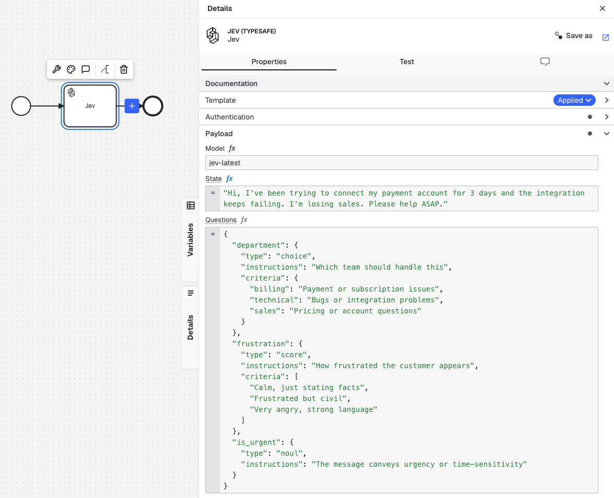

# Jev (TypeSafe) connector for Camunda 8

Bring [TypeSafe's Jev model](https://docs.typesafe.ai/introduction) into your Camunda processes to classify, score, or judge text and structured data. Ask targeted questions and use the structured answers to drive the next step of your process.

For example, you can route support requests to the right team, score customer feedback, or evaluate an intake record against review criteria.




## Features

- Ask several [Noul, Choice, or Score](https://docs.typesafe.ai/primitives) questions about the same data in one task.
- Route the process using typed answers, confidence scores, and probabilities.
- Track input and output token usage in your process data.

## Installation

Download [`typesafe-jev-connector.json`](element-templates/typesafe-jev-connector.json).

- **Hub / Web Modeler:** Upload the element template to your project.
- **Desktop Modeler:** Copy the file into your [element templates directory](https://docs.camunda.io/docs/components/modeler/desktop-modeler/element-templates/configuring-templates/) and restart Modeler.

Add a task to your BPMN diagram and apply **Jev (TypeSafe)** from the template picker. Requires Camunda 8.8 or later with standard connectors available.

## Setup

1. Get a TypeSafe API key and store it as a [Camunda secret](https://docs.camunda.io/docs/components/console/manage-clusters/manage-secrets/), for example `TYPESAFE_API_KEY`.
2. In the task's **Authentication** section, set **API key** to `{{secrets.TYPESAFE_API_KEY}}`, replacing the name if you chose a different one. Do not put the key itself in your BPMN.
3. In **Payload**, leave **Model** at `jev-latest` or choose another model. Supply the data to judge in **State**, and define the judgments in **Questions**.

For details about the available inputs, see TypeSafe's [state](https://docs.typesafe.ai/concepts/state) and [question primitives](https://docs.typesafe.ai/primitives) guides.

## Example: route a customer message

Suppose your process has a `customerMessage` variable containing a support request. Set **State** to `=customerMessage` to read that variable. In the FEEL-only **Questions** field, enter:

```feel
{
  "department": {
    "type": "choice",
    "instructions": "Which team should handle this?",
    "criteria": {
      "billing": "Payment or subscription issues",
      "technical": "Bugs or integration problems",
      "sales": "Pricing or account questions"
    }
  },
  "frustration": {
    "type": "score",
    "instructions": "How frustrated does the customer appear?",
    "criteria": [
      "Calm, just stating facts",
      "Frustrated but civil",
      "Very angry, strong language"
    ]
  },
  "is_urgent": {
    "type": "noul",
    "instructions": "The message conveys urgency or time-sensitivity"
  }
}
```

The default **Result expression** stores the response body in `jevResult`. For the questions above, a completed task might produce this process variable:

```json
{
  "jevResult": {
    "model": "jev-1.13.0",
    "answers": {
      "department": {
        "type": "choice",
        "choice": "technical",
        "confidence": 0.93,
        "probabilities": {
          "billing": 0.05,
          "technical": 0.95,
          "sales": 0
        }
      },
      "is_urgent": {
        "type": "noul",
        "noul": 0.99
      },
      "frustration": {
        "type": "score",
        "probabilities": {
          "0": 0,
          "1": 1,
          "2": 0
        },
        "score": 1,
        "confidence": 1,
        "legend": {
          "0": "Calm, just stating facts",
          "1": "Frustrated but civil",
          "2": "Very angry, strong language"
        }
      }
    },
    "usage": {
      "input_tokens": 425,
      "output_tokens": 73
    }
  }
}
```

For example, a gateway can route to the technical team with `=jevResult.answers.department.choice = "technical"` or flag urgent requests with `=jevResult.answers.is_urgent.noul > 0.8`. See TypeSafe's [response-body guide](https://docs.typesafe.ai/api#response-body) for the answer structure.

You can adjust **Result expression** to map specific answers into separate process variables or use **Result variable** instead.
